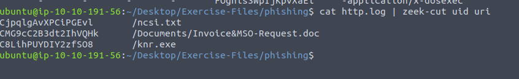

# Challenge Room Documentation

---

## Overview
- **Room Name**: Zeek Exercises
- **Platform**: TryHackMe
- **Date Completed**: May 2, 2025
- **Difficulty**: Medium

---

## Objectives
Put your Zeek skills into practice and analyse network traffic.

---

## Tools Used
- Zeek

---

## Screenshots with Brief Descriptions
### Screenshot 1: IPv6

- The hint says that DNS records containing IPv6 addresses contain “AAAA”. This can be confirmed by using cat dns.log. I then used the following commands cat dns.log | grep ‘AAAA’ | nl. The screenshot shows that there are 320 records containing IPv6 addresses.

### Screenshot 2: Duration

- I first used the command cat conn.log | grep ‘duration’ to confirm that there is a header field named duration. This was the case so I used cat conn.log | zeek-cut duration | sort -n | nl. This outputted the largest duration at the end of the list. The answer is 9.420791.

### Screenshot 3: Unique Queries

- I used the hint for this question after trying other methods. I added sort, uniq and wc -l to determine the number of unique domain queries. 
### Screenshot 4: Source Host IP

- I used cat conn.log | zeek-cut id.orig_h. This listed the ip address of the source host. 
### Screenshot 5: Suspicious Source Host

- This question asked me to find suspicious source address. I used the cat command on conn.log and noticed that there is only one source address. I used cat conn.log | zeek-cut id.org_h | uniq to clearly show this. 
### Screenshot 6: Suspicious URL

- I simply used cat http.log and noticed that a knr.exe and Invoice request document were received from smart-fax.com. I used cyberchef to defang url. 

### Screenshot 7: Malicious File

- I ran the hash-demo.zeek script on phishing.pcap. I then used cat to look at files.log and zeek-cut to cut md5 hash and mime_name. The has in question is the md5 hash for msword. I pasted this hash into virus total and went to relations tab. I then was able to click on name of file and go to community tab where a member had detected a macro VBA document. 

### Screenshot 8: File Name

- I used the same command but this time pasted the md5 hash for the executable into Virus Total. The details tab showed the name of the file: PleaseWaitWindow.exe. 

### Screenshot 9: Domain Name

- I pasted the md5 hash for the .exe file and discovered that the domain name is hopto.org.  

### Screenshot 10: Request Name

- After using cat http.log it is easy to see that the uri contains the request name. I used zeek-cut to make this easier to see.  

### Screenshot 11: Signature Hits

- I used cat signatures.log and I was able to visually see that there are 3 signature hits.  

### Screenshot 12: Scanning Tool

- I used cat to view http.log file and I was able to see that Nmap was used for scanning.  

### Screenshot 13: File Extension

- I used zeek-cut uri and used sort and uniq commands. I was then able to see that the extension was .class.  

### Screenshot 14: File Name

- I used cat log4j.log | head and found the base 64 command. I used cyberchef to decode base64 and I found that the name of the file is “pwned”. 

---

## Conclusion
- I found this room to be relatively straightforward. Question 3 was tricky and I was not able to use learned methods to solve. I had to look to hint for a starting point. The rest of the questions could be answered with methods learned in Zeek room.

---

